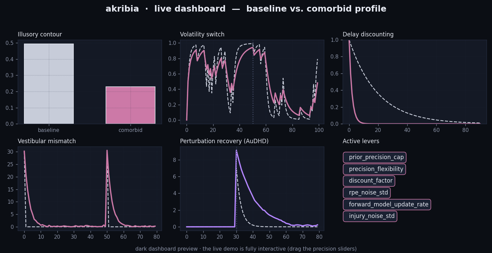
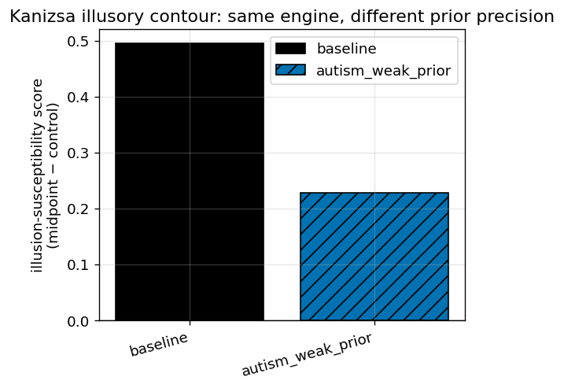

# akribia
### A unified computational model of precision-weighted Bayesian inference across autism, ADHD, and PPCS

[](https://github.com/Londopy/akribia/actions/workflows/ci.yml)
[](./LICENSE)

***One inference engine. Three miscalibrations. Same math.***

**▶ [Try the live demo](https://londopy.github.io/akribia/)** — the full dashboard runs in your browser, no install. · **[⬇ Download the desktop app](https://github.com/Londopy/akribia/releases)**

> ### This is not a diagnostic tool
> akribia is a computational-psychiatry **research replication and exploration**
> tool. It implements published mathematical models of precision-weighted Bayesian
> inference to illustrate *theoretical mechanisms* proposed in the literature for
> autism, ADHD, and PPCS. **It is not a diagnostic tool, has not been validated
> against patient data, and should not be used to assess, diagnose, or characterize
> any individual's condition** — including the author's. The autism
> precision-weighting literature in particular is actively contested (see
> [docs/THEORY.md](./docs/THEORY.md)); this project models competing hypotheses,
> not settled fact.
>
> akribia runs entirely on **synthetic, simulated data**. It does not collect,
> store, transmit, or process any personal, behavioral, or health information.

## Desktop app — the interactive explorer

[](https://londopy.github.io/akribia/)

*The dark dashboard — baseline vs. a comorbid profile across all five tasks. [Open it live](https://londopy.github.io/akribia/) and drag the precision sliders.*

akribia ships a rich, dark, **interactive desktop app** (Tauri + React + Tailwind):
pick a profile in the sidebar, drag a precision lever, and watch every task's
behaviour update **live** against the neurotypical baseline — all computed by the
same validated Rust core, no Python required.

**Install (no build needed):** grab the installer for your OS from the
**[Releases page](https://github.com/Londopy/akribia/releases)** — `.msi`/`.exe`
(Windows), `.dmg` (macOS), `.AppImage`/`.deb` (Linux). These are built
automatically by GitHub Actions when a `v*` tag is pushed.

> **Installers are unsigned.** Windows: click "More info" → "Run anyway" on the
> SmartScreen prompt. macOS: right-click the app → Open (or
> `xattr -d com.apple.quarantine <file>`).

**Or build / run it yourself:**

```bash
cd gui
npm install
npm run tauri dev      # live dev window with hot reload
npm run tauri build    # installer lands in gui/src-tauri/target/release/bundle/
```

Requires Node, a current stable Rust toolchain, and WebView2 (preinstalled on
Windows 10/11). The Python research layer (below) stays available for notebooks,
sweeps and validation.

## See the thesis demonstrated in ~90 seconds

→ **[`notebooks/00_golden_path.ipynb`](./notebooks/00_golden_path.ipynb)** — baseline
vs. one profile vs. one plot. The single image below is the whole idea: the *same*
engine and the *same* task, under two precision parameterizations, produce different
perceptual behaviour.



The neurotypical `baseline` "sees" a Kanizsa illusory triangle (high
illusion-susceptibility score); `autism_weak_prior` caps prior precision, so absent
local evidence dominates and the illusion weakens — the literature's *reduced
illusion* finding, reproduced.

## Quickstart

```bash
git clone https://github.com/Londopy/akribia.git && cd akribia
docker compose -f .devcontainer/docker-compose.yml up -d   # or: maturin develop && pip install -e ".[dev]"
python -m akribia.tasks.illusion_task --profile autism_weak_prior --plot
```

Runs the illusory-contour task under the weak-prior autism profile and saves a
comparison plot against baseline. Swap `--profile` for any entry in the
[Profile Catalog](./wiki/Profile-Catalog.md). No Rust toolchain? It still runs — the
package falls back to a pure-Python core (`python -c "from akribia import core;
print(core.BACKEND)"`). Or launch the interactive app: `cd gui && npm run tauri dev`.

## The thesis

Predictive coding treats the brain as a hierarchical inference machine: a
**prediction** meets **evidence**, the mismatch is a **prediction error**, and that
error is weighted by **precision** (inverse variance — how much the system trusts the
signal) before updating beliefs. The same precision-weighting math, miscalibrated at
different points in the hierarchy, produces phenotypically distinct conditions:

| Condition | Where precision miscalibration lives | Core failure mode |
|---|---|---|
| **Autism** (perceptual) | sensory/perceptual priors, level 1–2 | inflexible precision — persistently high (overfitting) or low (raw-data dominant) |
| **ADHD** (reward/valuation) | dopaminergic RPE, temporal discounting | discount rate too steep, or reward gain unstable |
| **PPCS** (sensorimotor) | forward-model / efference-copy comparison | post-injury forward model miscalibrated; persistent unresolved mismatch |

akribia implements **one** core engine with pluggable "lesion profiles" (one
`PrecisionProfile` dataclass, six levers), plus a literature-grounded **comorbidity
(AuDHD)** mode — because co-occurrence is common and the more realistic case to model.

## Theory

Each condition's module reproduces specific, *pre-registered* predictions from the
literature (encoded as `tests/test_predictions.py`):

- **Autism** — weak priors reduce illusion susceptibility; HIPPEA (inflexible
  precision) produces a *transient* reconvergence delay after a context switch.
- **ADHD** — steep discounting collapses the delay-discounting AUC; unstable reward
  gain produces erratic learning.
- **PPCS** — an impaired forward-model update rate leaves a persistent vestibular
  mismatch that does not habituate.
- **AuDHD** — a *non-additive* signature: slow recovery (autism inertia) AND erratic
  recovery (ADHD gain noise), distinct from the average of the two.

Full literature review, with the competing hypotheses and the framework-level
critique of the Bayesian-brain paradigm itself, in **[docs/THEORY.md](./docs/THEORY.md)**
and the **[Wiki](./wiki/Home.md)**.

## Architecture

```
            core/  (Rust — the inference math, fast, no GC pauses)
   kalman.rs · hgf.rs · td_learning.rs · forward_model.rs · error.rs
         │ PyO3 (akribia._core)              │ rlib (direct link)
         ▼                                   ▼
   akribia/ (Python orchestration)     gui/src-tauri (Tauri/Rust)
   profiles · tasks · viz · validation  React + Tailwind + shadcn/Radix
         │ every task emits schemas/task_result.json
         ▼
   viz (plots) · validation (per-parameter recovery) · GUI (display)
```

The Rust core is the numerical engine; the Python layer is the research surface
(notebooks, sweeps, CI-enforced validation); the optional Tauri GUI links the same
Rust crate directly for live, interactive exploration. The pure-Python fallback core
mirrors the Rust math so the project runs with or without a Rust toolchain. See
**[docs/architecture.md](./docs/architecture.md)** for the ADR log and rationale.

## Installation / dev environment

One command: open the repo in VS Code Dev Containers / GitHub Codespaces and the
[devcontainer](./.devcontainer) builds the Rust+Python toolchain and runs
`maturin develop` automatically. See [CONTRIBUTING.md](./CONTRIBUTING.md) for manual
setup and the extension points (adding a profile/task). `pre-commit install` runs the
same checks CI runs.

## Validation & benchmarks (honestly reported)

- **Per-parameter recovery** ([docs/LIMITATIONS.md](./docs/LIMITATIONS.md)):
  `discount_factor` and `prior_precision_cap` recover cleanly (corr ≈ 1.0);
  `precision_flexibility` is **weakly identified** (corr ≈ 0.44) and reported as
  such. The CI gate is defined only on the reliably-recoverable parameters.
- **Two independent core implementations** (Rust + Python) agree to ~1e-16.
- **Performance** ([docs/BENCHMARKS.md](./docs/BENCHMARKS.md)): the boundary-free
  Rust Kalman core is **~5.6× faster** than pure Python (measured, not asserted),
  with an honest note about PyO3 boundary overhead on single calls.

## Related work

- **TAPAS** (Mathys et al.) — the reference HGF/computational-psychiatry toolbox.
  akribia's contribution is the cross-condition profile framework (autism/ADHD/PPCS
  under one engine) with a comorbidity mode, not a novel filtering algorithm. TAPAS
  is GPL and is **compared against, never linked or copied from** (see
  [docs/architecture.md](./docs/architecture.md) §5).
- **PyHGF / pymdp** — Python-native HGF / active-inference libraries; viable
  reference oracles.

## Accessibility (spec 9)

Plots use the **Okabe-Ito** colorblind-safe palette and pair colour with distinct
line styles/markers (never colour alone), so figures read in grayscale and
colorblind vision. Theory pages open with a plain-language paragraph before the
math; jargon is defined in [docs/GLOSSARY.md](./docs/GLOSSARY.md). The Tauri GUI is
built on Radix UI, whose ARIA compliance is real accessibility infrastructure.

## Roadmap

Predictive coding's reach extends well past these three conditions. Each slots into
the *same* profile architecture (a new `profiles/<condition>_<mechanism>.py` + a
literature-grounded parameterization + a demonstrating task): **schizophrenia**
(aberrant precision in hierarchical message passing), **anxiety** (overestimated
threat precision), **depression** (biased reward valuation), **addiction**
(pathological cue RPE). akribia "happens to start with three conditions relevant to
the author," not "models the author."

## Links

- [Wiki](./wiki/Home.md) — theory deep-dive & FAQ · [docs/THEORY.md](./docs/THEORY.md)
- [docs/LIMITATIONS.md](./docs/LIMITATIONS.md) · [docs/architecture.md](./docs/architecture.md)
- [CONTRIBUTING.md](./CONTRIBUTING.md) · [SECURITY.md](./SECURITY.md) · [CHANGELOG.md](./CHANGELOG.md)
- [CITATION.cff](./CITATION.cff) — GitHub renders a "Cite this repository" button.

> **GUI installers are unsigned.** macOS Gatekeeper / Windows SmartScreen will block
> them by default. macOS: right-click → Open, or
> `xattr -d com.apple.quarantine <file>`. Windows: "More info" → "Run anyway".

## License

[MIT](./LICENSE) © Londopy. *akribia* (ἀκρίβεια) — exactness, precision.
